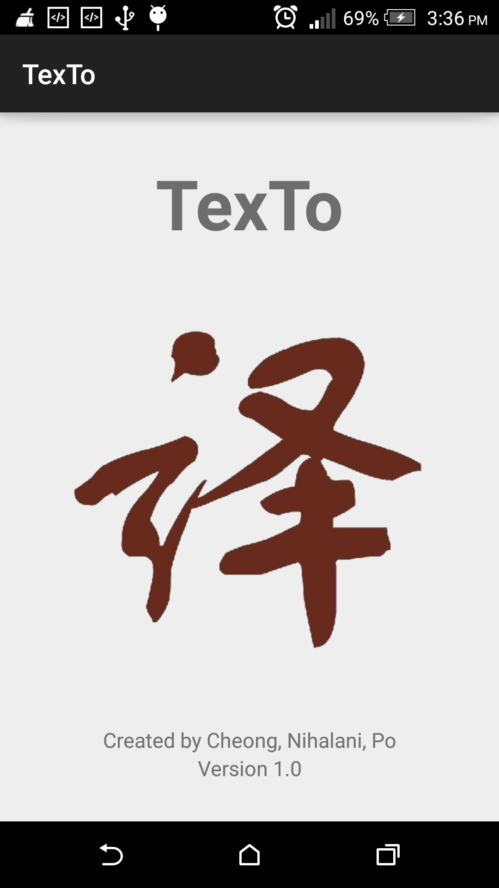
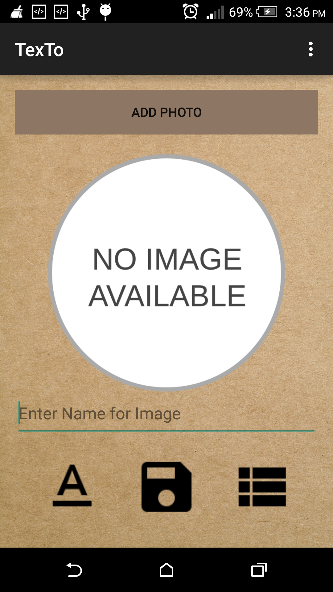
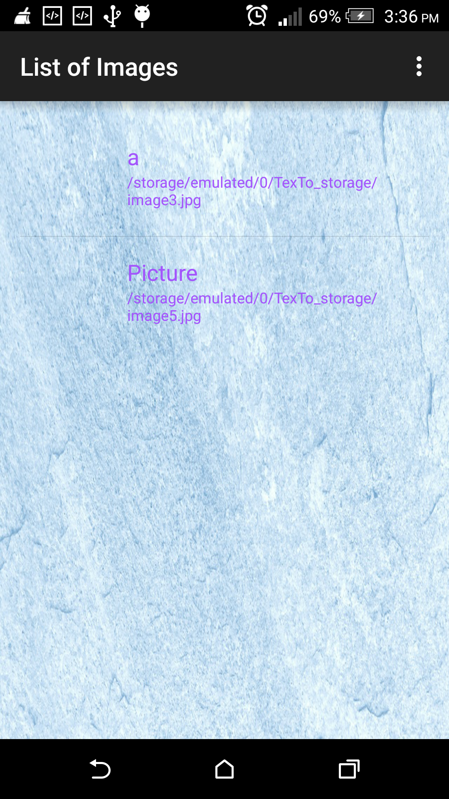
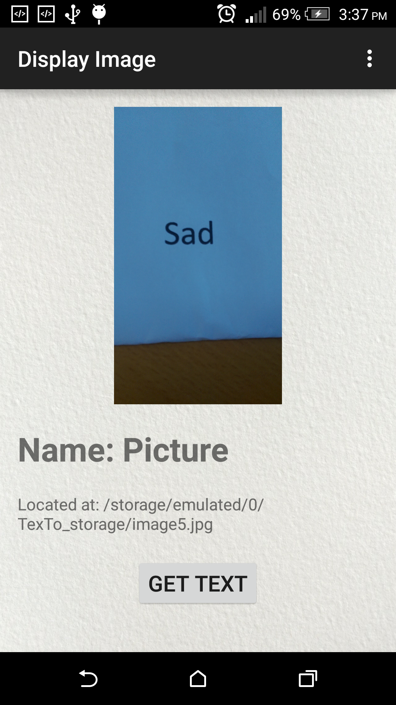
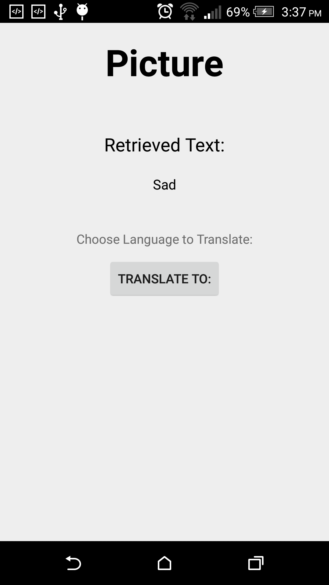
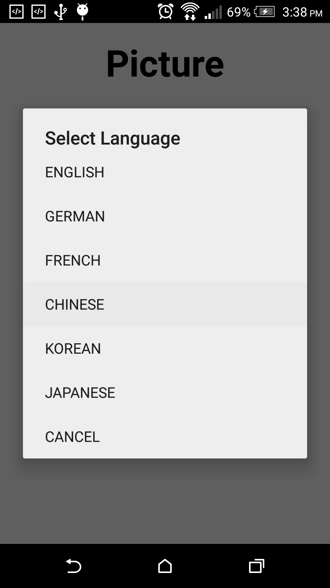
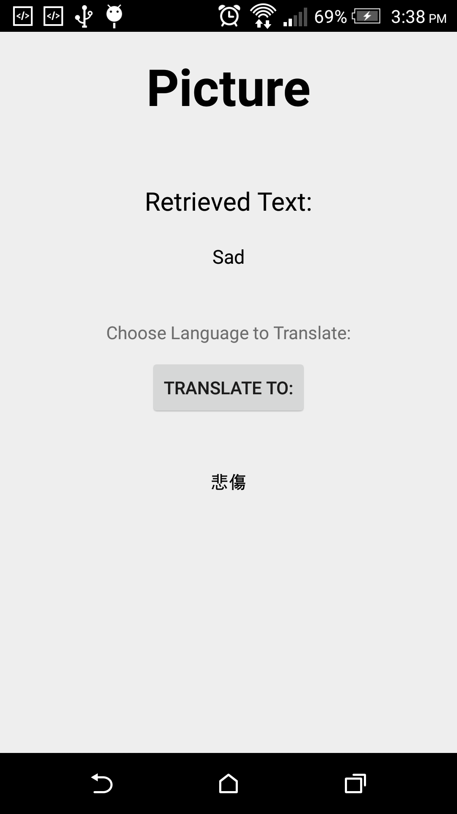

# finalproject2015-rohit0000
finalproject2015-rohit0000 created by Classroom for GitHub

# TexTo

## Prerequisites
1) Tesseract Library (only the tess two from : https://github.com/rmtheis/tess-two)

## Details
Our project makes use of the Tesseract Library which will be used for the OCR. These words will then be stored in a database.
Our project also makes use of Microsoft translator which will translate the recognized text to German, French, Chinese, Japanese, and Korean. We allow the user to take a picture of retrieve an image from the gallery. 

## Limitations
We cannot successfully let our app read all of the text shown in the camera. We recommend taking plain text with a 
white background to allow the text recognition algorithm to read the text. Once translated, internet connection is 
a must in order to translate the word in different languages.

# GOOGLE PLAY LINK
https://play.google.com/store/apps/details?id=ph.edu.dlsu.texto

##Instructions

1)  Add a Photo (Take a Picture or Choose from Gallery).
2)  Enter a name for the image.
3)  Select an image button.
4a) From left to right, the first button is for direct Text Recognition.
4b) Click the button "TRANSLATE TO:" to choose what language you want the text to be translated.
5)  Second button will allow you to save the image and the name in a database.
6a) Third button will allow you to check the images from the database.
6b) You can choose what image you like in the list.
6c) Get the Text from the image
6d) Click the button "TRANSLATE TO:" to choose what language you want the text to be translated.
7)  Fourth button will allow you to go to Help Activity.

##Screenshot

SPLASH SCREEN

MAIN SCREEN

CHECKLIST

TEXT

TEXT RECOGNIZED

TRANSLATE ALERT BOX

TRANSLATED TEXT (CHINESE)

